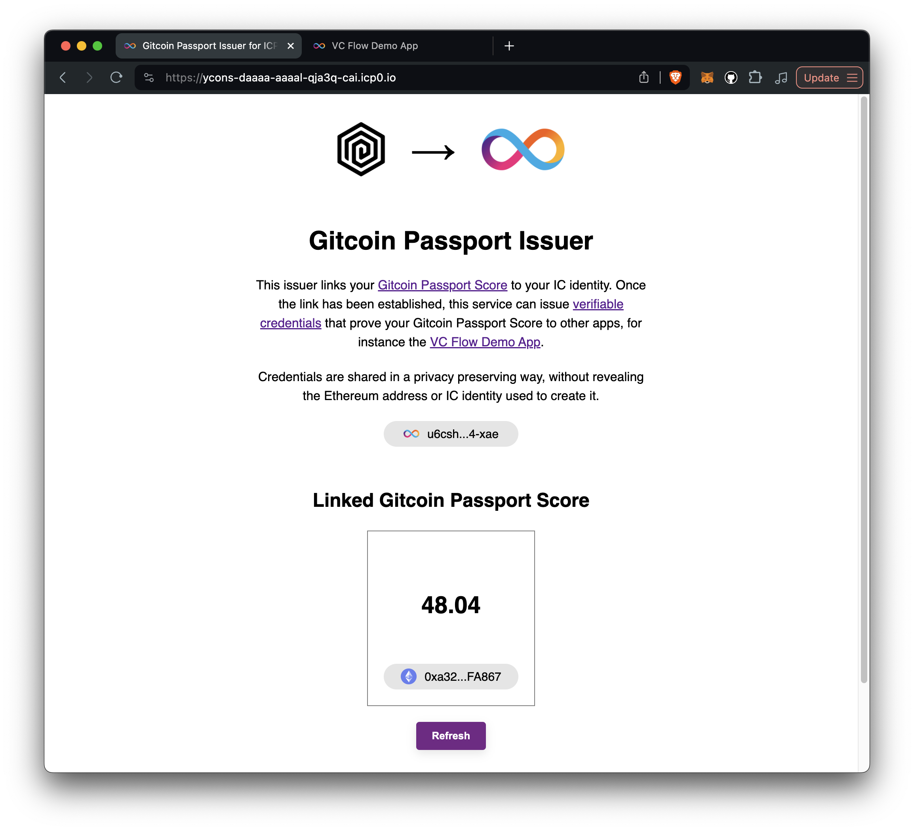

# ICP Passport Score Issuer

This project demos the use of [verifiable credentials](https://internetcomputer.org/docs/current/developer-docs/identity/verifiable-credentials/overview) on the [Internet Computer](https://internetcomputer.org/). It uses [Gitcoin Passport](https://passport.gitcoin.co) as an example source of verifiable credentials.

Verifiable credentials is allows organizations and individuals to create and share their identities and claims securely. Support for verifiable credentials was recently introduced to the identity layer of the Internet Computer (IC), enabling developers to issue and verify credentials on the IC platform. 

## About Gitcoin Passport
> *Passport helps you collect “stamps” that prove your humanity and reputation.* 

The more stamps you collect, the higher your reputation. Passport scores are accessible through an API provided by Gitcoin can also be minted as "attestations" on Ethereum. Up until now, the passport score is a credential that has not been available on IC.

### Project Structure

The project consists of four main packages, two Rust based backend canisters and two frontend canisters built using React.

### 1. [`issuer_backend`](./packages/issuer_backend)

Stores the link between Gitcoin Passport and II account and issues verifiable credentials to prove the Gitcoin Passport Score.

### 2. [`issuer_frontend`](./packages/issuer_frontend)



In this interface, the user logs in with their Ethereum address and II credentials and then links their Gitcoin Passport to their II account.

Try it out: https://ycons-daaaa-aaaal-qja3q-cai.icp0.io

### 3. [`demo_app_backend`](./packages/demo_app_backend)

Provides an endpoint called `do_something` that requires the user to prove their Gitcoin Passport Score. The endpoint returns a string that is the result of the verifiable credential verification.

### 3. [`demo_app_frontend`](./packages/demo_app_backend)


Here, the user can securely request a verifiable credential from the issuer proving their Gitcoin Passport Score.

Try it out: https://jzi4k-7qaaa-aaaal-qdncq-cai.icp0.io

## Run locally

Before you get started, make sure you have `dfx` installed. You can find instructions on how to install `dfx` [here](https://internetcomputer.org/docs/current/developer-docs/build/install-upgrade-remove).

### 1. Start the local replica

```bash
dfx start --clean
```

### 2. Deploy the canisters

```bash
make deploy-all
```

## How does all this work?

I published an article that provides a more detailed explanation of how verifiable credentials work on the IC. It also includes a walkthrough of the demo app:

### 👀 [Bring the Gitcoin Passport score to the Internet Computer](https://kristoferlund.se/blog/240703-verifiable-credentials)

Also, check out the developer documentation provided by IC:

### 👀 [Verifiable credentials overview](https://internetcomputer.org/docs/current/developer-docs/identity/verifiable-credentials/overview)


## Author

- [kristofer@kristoferlund.se](mailto:kristofer@kristoferlund.se)
- Twitter: [@kristoferlund](https://twitter.com/kristoferlund)
- Discord: kristoferkristofer
- Telegram: [@kristoferkristofer](https://t.me/kristoferkristofer)

## License

This project is licensed under the MIT License. See the LICENSE file for more details.