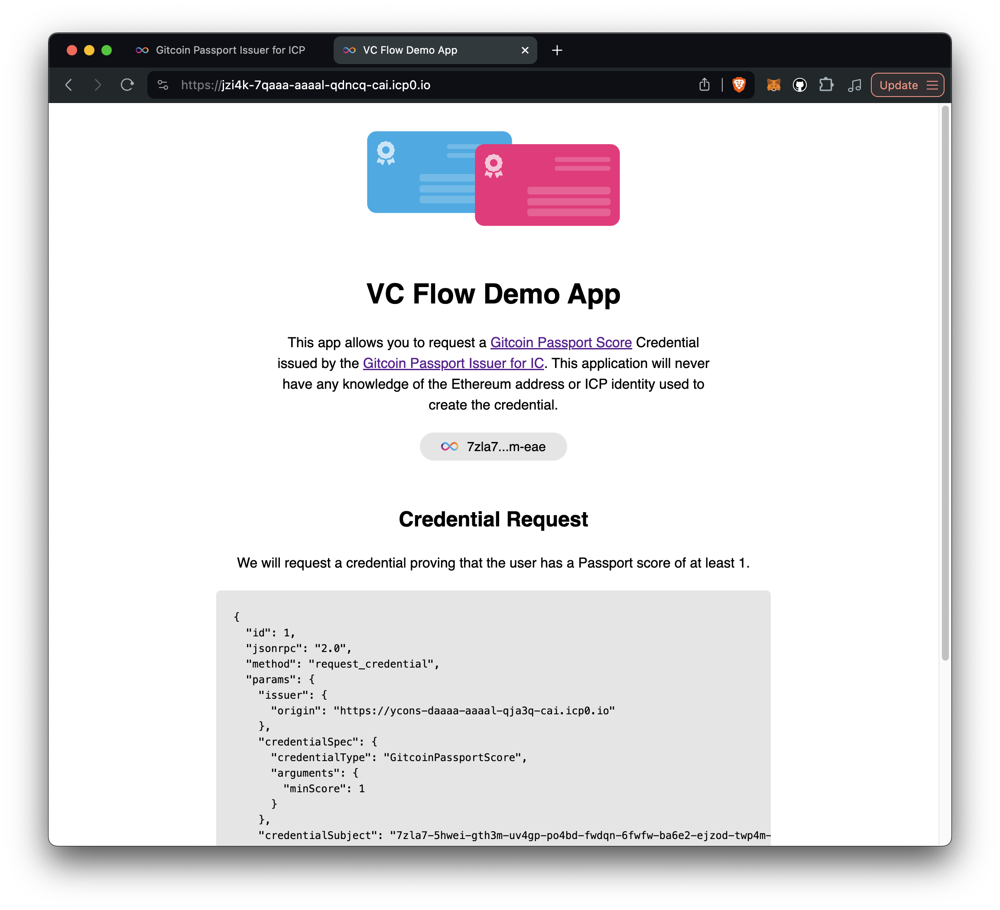

# ICP Passport Score Issuer

This project demos the use of [verifiable credentials](https://internetcomputer.org/docs/current/developer-docs/identity/verifiable-credentials/overview) on the [Internet Computer](https://internetcomputer.org/). It uses [Gitcoin Passport](https://passport.gitcoin.co) as an example source of verifiable credentials.

**About Gitcoin Passport:** *Passport helps you collect “stamps” that prove your humanity and reputation.* The more stamps you collect, the higher your reputation. Passport scores are accessible through an API provided by Gitcoin can also be minted as "attestations" on Ethereum. Up until now, the passport score is a credential that has not been available on IC.

The project consists of three main packages:

## 1. [`issuer_backend`](./packages/issuer_backend)

Stores the link between Gitcoin Passport and II account and issues verifiable credentials to prove the Gitcoin Passport Score.

## 2. [`issuer_frontend`](./packages/issuer_frontend)


In this interface, the user logs in with their Ethereum address and II credentials and then links their Gitcoin Passport to their II account.

Try it out: https://ycons-daaaa-aaaal-qja3q-cai.icp0.io

### 3. [`demo_app`](./packages/demo_app)



Here, the user can securely request a verifiable credential from the issuer proving their Gitcoin Passport Score.

Try it out: https://jzi4k-7qaaa-aaaal-qdncq-cai.icp0.io

## Run locally

### 1. Start the local replica

```bash
dfx start --clean
```

### 2. Deploy the canisters

```bash
make deploy-all
```

## How does all this work?

I am writing an article that will be out soon. In the mean time, check out the source code and see the information provided by IC: [How verifiable credentials on IC works](https://internetcomputer.org/docs/current/developer-docs/identity/verifiable-credentials/how-it-works)

## Author

- [kristofer@kristoferlund.se](mailto:kristofer@kristoferlund.se)
- Twitter: [@kristoferlund](https://twitter.com/kristoferlund)
- Discord: kristoferkristofer
- Telegram: [@kristoferkristofer](https://t.me/kristoferkristofer)

## License

This project is licensed under the MIT License. See the LICENSE file for more details.